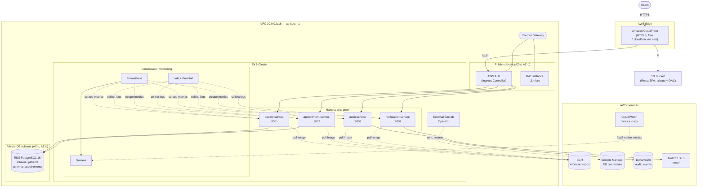
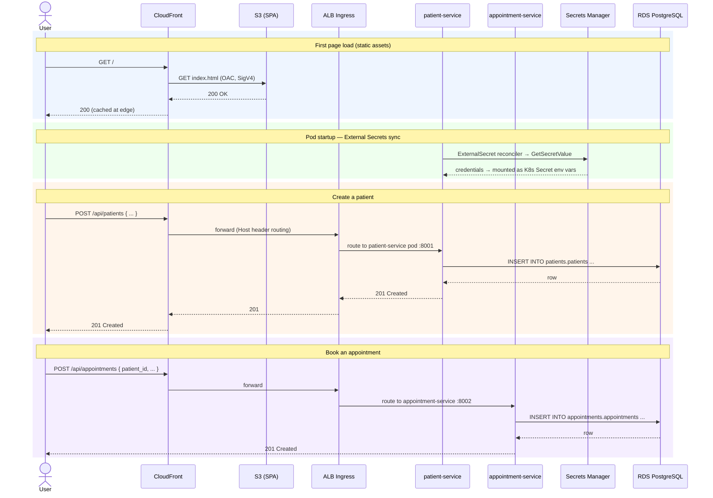
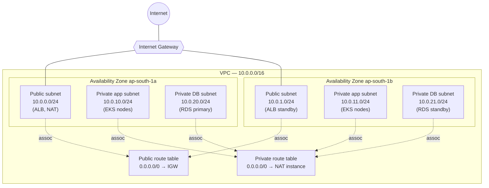
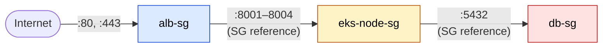
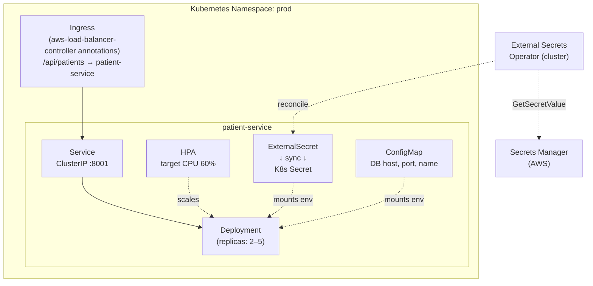
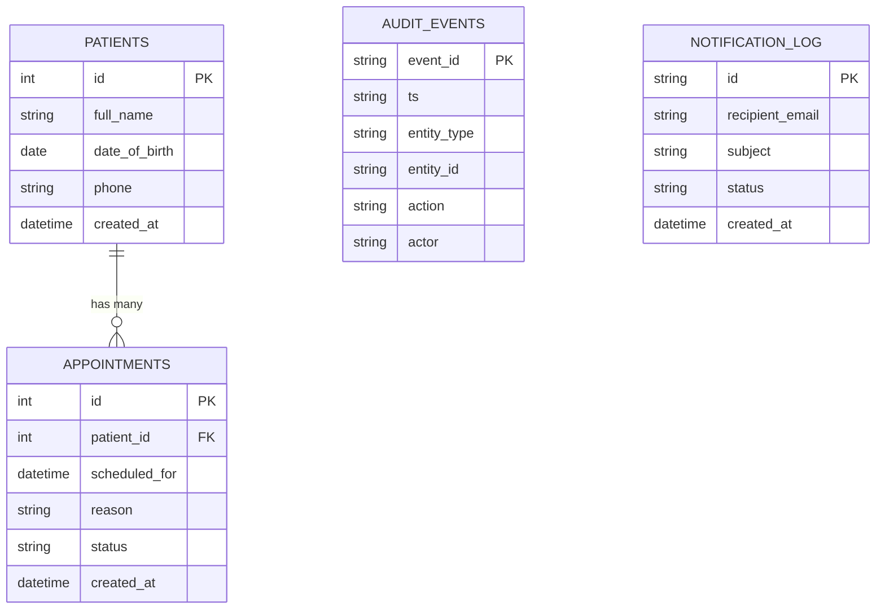
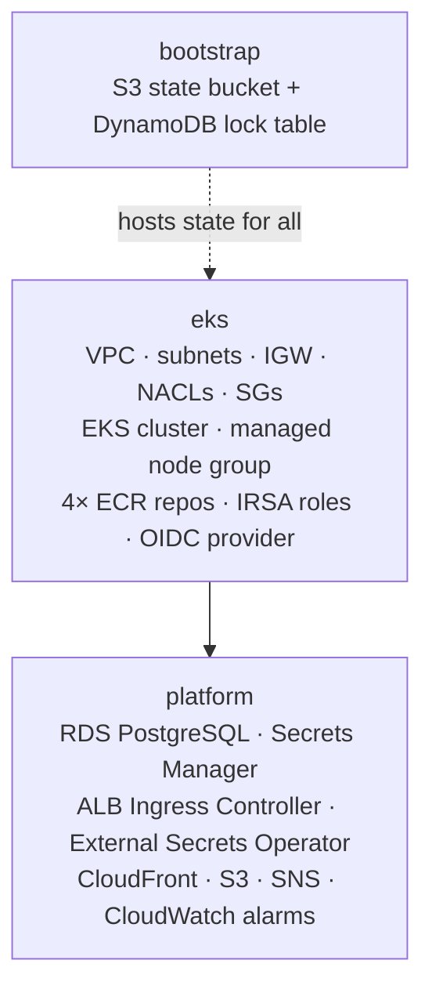
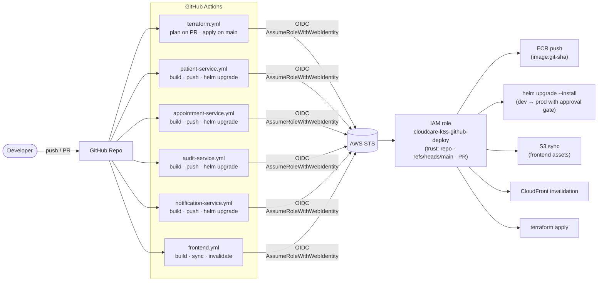
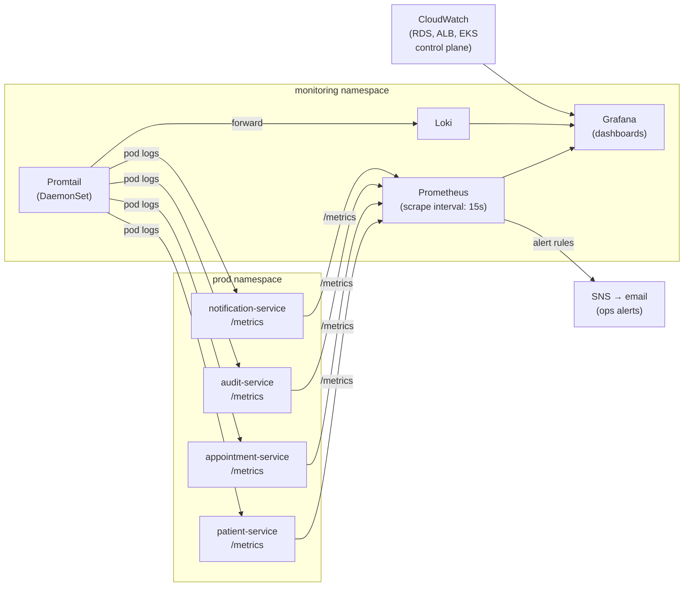

# CloudCare-K8s — AWS DevOps Showcase v2

> **The evolution of CloudCare.**
> Same hospital management system. Migrated from a monolithic EC2/ASG deployment
> to a **microservices architecture orchestrated on Kubernetes** — the way modern
> engineering teams actually run production workloads.

**Region** `ap-south-1` (Mumbai) · **IaC** Terraform 1.9+ · **Orchestration** Kubernetes 1.30 on EKS ·
**Backend** Python 3.12 + FastAPI (4 microservices) · **Frontend** React 18 + Vite ·
**CI/CD** GitHub Actions + OIDC · **Observability** Prometheus + Grafana + Loki

---

## Scope — what this repo is and isn't

This project demonstrates **Kubernetes, microservices operations, and cloud-native SRE** on AWS.
The hospital management app (patients, appointments) is intentionally minimal CRUD — it exists to
give the infrastructure something real to host and operate.

> **UI/UX is out of scope.** The web frontend proves the stack is wired up end-to-end
> (`CloudFront → S3` for assets, `CloudFront → ALB Ingress → EKS services → RDS` for the API).
> To evaluate this project, read the Terraform stacks, Helm charts, GitHub Actions workflows,
> and the architecture sections below.

---

## How v2 Differs from CloudCare v1

| Concern | CloudCare v1 (EC2/ASG) | CloudCare-K8s v2 (EKS) |
|---|---|---|
| Deployment unit | Single FastAPI monolith | 4 independent microservices |
| Compute | EC2 Auto Scaling Group | EKS node group (t3.micro) |
| Scaling | ASG instance-refresh (~5 min) | HPA pod scale-out (~30 sec) |
| Rollout strategy | New AMI, wait for health check | Kubernetes rolling deploy |
| Rollback | Re-push previous image | `helm rollback <service> <revision>` |
| Image tagging | `:latest` | Git SHA (`:abc1234`) — immutable |
| Secrets | Fetched at EC2 boot | External Secrets Operator → pod env |
| Observability | CloudWatch only | Prometheus + Grafana + Loki + CloudWatch |
| Config management | Env vars baked into launch template | ConfigMaps + Secrets per namespace |
| Multi-environment | Single environment | `dev` and `prod` namespaces |
| CI/CD scope | One pipeline for the whole backend | One pipeline **per service** |

**Interview narrative:**
*"I built CloudCare on traditional AWS infrastructure to understand the fundamentals.
Then I re-platformed it onto Kubernetes to learn how modern teams actually operate
containerised workloads — independent deployments, faster rollouts, and a proper
observability stack."*

---

## Tech Stack

Twenty-eight tools, grouped by what they do in the system.

<table>
  <tr>
    <td width="33%" valign="top">
      <h4>Cloud &amp; Orchestration</h4>
      <p>
        
        
        
        
        
        
      </p>
      <sub>EKS managed control plane; Terraform declares every resource; Helm packages per-service charts; Kustomize overlays for dev/prod differences.</sub>
    </td>
    <td width="33%" valign="top">
      <h4>Compute &amp; Networking</h4>
      <p>
        
        
        
        
        
      </p>
      <sub>EKS t3.micro node group; one ECR repo per service; AWS ALB Ingress Controller routes external traffic; NAT instance saves ~$32/mo vs NAT Gateway.</sub>
    </td>
    <td width="33%" valign="top">
      <h4>Edge</h4>
      <p>
        
        
      </p>
      <sub>One HTTPS origin for the whole app; React SPA served from private S3 via Origin Access Control; API requests forwarded to ALB Ingress.</sub>
    </td>
  </tr>
  <tr>
    <td width="33%" valign="top">
      <h4>Data</h4>
      <p>
        
        
        
        
      </p>
      <sub>Schema-per-service on shared RDS; audit events on DynamoDB; External Secrets Operator syncs Secrets Manager → Kubernetes Secrets automatically.</sub>
    </td>
    <td width="33%" valign="top">
      <h4>Observability</h4>
      <p>
        
        
        
        
        
      </p>
      <sub>Prometheus scrapes all pods + node exporters; Grafana dashboards service health & latency; Loki aggregates logs via Promtail; CloudWatch covers AWS-native resources.</sub>
    </td>
    <td width="33%" valign="top">
      <h4>Identity &amp; CI/CD</h4>
      <p>
        
        
      </p>
      <sub>IRSA gives each pod its own AWS identity — no node-level credentials; keyless CI via OIDC; one pipeline per service for independent deployability.</sub>
    </td>
  </tr>
  <tr>
    <td width="33%" valign="top">
      <h4>Application</h4>
      <p>
        
        
        
      </p>
      <sub>Python 3.12 microservices, React 18 SPA built with Vite — the simplest CRUD needed to wire the stack.</sub>
    </td>
    <td width="33%" valign="top">
      <h4>Local Dev</h4>
      <p>
        
        
      </p>
      <sub>Full stack runs locally via Docker Compose; manifests validated on minikube — no cloud costs during development.</sub>
    </td>
    <td width="33%" valign="top">
      <h4>Messaging</h4>
      <p>
        
        
      </p>
      <sub>notification-service calls SES for transactional email; SNS fans out CloudWatch alarms to ops email.</sub>
    </td>
  </tr>
</table>

---

## Engineering Practices Demonstrated

| # | Practice | Where to find it |
|---|---|---|
| 1 | **Microservices decomposition** — logical boundaries, independent deployability | `services/`, `helm/`, `.github/workflows/` |
| 2 | **Kubernetes-native scaling** — HPA replaces ASG instance-refresh | `helm/*/templates/hpa.yaml` |
| 3 | **Immutable image tags** — git SHA, not `:latest` | every `*-service.yml` workflow |
| 4 | **GitOps deployment** — Helm chart is the source of truth, CI applies it | `helm/`, workflows |
| 5 | **IRSA least-privilege** — pod-level AWS permissions, not node-level | `terraform/eks/irsa.tf` |
| 6 | **External Secrets Operator** — secrets live in Secrets Manager, never in Git | `helm/*/templates/externalsecret.yaml` |
| 7 | **Multi-environment with manual approval gate** — `dev` vs `prod` namespace | `deploy-prod` job, GitHub environments |
| 8 | **Three-pillar observability** — metrics (Prometheus), logs (Loki), dashboards (Grafana) | `monitoring/` |
| 9 | **Keyless CI/CD** — OIDC, no stored AWS keys, `sub` claim pinned to repo + ref | `terraform/eks/oidc.tf` |
| 10 | **Database-per-service pattern** — schema isolation with documented upgrade path | `docs/02-microservices-split.md` |

---

## Table of Contents

- [Architecture at a glance](#architecture-at-a-glance)
- [Architecture diagram](#architecture-diagram)
- [Microservices breakdown](#microservices-breakdown)
- [Request flow](#request-flow)
- [Network topology](#network-topology)
- [Security architecture](#security-architecture)
- [Kubernetes resource model](#kubernetes-resource-model)
- [Data model](#data-model)
- [Infrastructure modules](#infrastructure-modules)
- [CI/CD pipeline](#cicd-pipeline)
- [Observability](#observability)
- [Repository structure](#repository-structure)
- [Prerequisites](#prerequisites)
- [Quick start — deploy from scratch](#quick-start--deploy-from-scratch)
- [Local development](#local-development)
- [Cost](#cost)
- [Teardown](#teardown)
- [Documentation & learning path](#documentation--learning-path)

---

## Architecture at a glance

Users hit **CloudFront**. Static React assets come from a private **S3** bucket via Origin
Access Control. API requests (`/api/*`) are forwarded to an **AWS ALB Ingress Controller**
which routes them to the appropriate microservice **pods** inside the **EKS cluster**.

Four microservices run in the `prod` namespace: `patient-service`, `appointment-service`,
`audit-service`, and `notification-service` — each independently deployable with its own
ECR repo, Helm chart, and GitHub Actions pipeline. Services talk to a private
**RDS PostgreSQL** instance using schema isolation. The **External Secrets Operator** syncs
credentials from **Secrets Manager** into Kubernetes Secrets at pod startup.

The monitoring stack (Prometheus + Grafana + Loki) runs inside the cluster in its own
namespace and scrapes metrics and logs from every pod.

---

## Architecture diagram



---

## Microservices Breakdown

Each service is independently deployable with its own Docker image, ECR repo, Helm chart,
GitHub Actions workflow, and database schema.

| Service | Port | Owns | Stores data in |
|---|---|---|---|
| `patient-service` | 8001 | `patients` PostgreSQL schema | RDS |
| `appointment-service` | 8002 | `appointments` PostgreSQL schema | RDS |
| `audit-service` | 8003 | `audit_events` DynamoDB table | DynamoDB |
| `notification-service` | 8004 | Nothing persistent — calls SES | — |

---

## Request flow

A typical "load the patients page, then book an appointment" sequence, including pod startup
secret sync:



---

## Network topology

Six subnets across two AZs, three tiers — identical topology to v1, with EKS nodes replacing
the ASG:



| CIDR | Tier | Public? | Purpose |
|------|------|---------|---------|
| `10.0.0.0/24`, `10.0.1.0/24` | Public | ✅ (route → IGW) | ALB Ingress, NAT instance |
| `10.0.10.0/24`, `10.0.11.0/24` | App (private) | ❌ (egress via NAT) | EKS worker nodes |
| `10.0.20.0/24`, `10.0.21.0/24` | DB (private) | ❌ (local only) | RDS PostgreSQL |

> DB subnets have **no NAT route** — the database has zero egress and is only reachable
> from the app subnet.

---

## Security architecture

### Defense in depth — the security-group chain

Each tier accepts traffic **only from the tier directly in front of it**, by referencing the
upstream security group, not an IP range:



| SG | Ingress | Source | Egress |
|----|---------|--------|--------|
| `alb-sg` | 80, 443 (TCP) | `0.0.0.0/0` | all |
| `eks-node-sg` | 8001–8004 (TCP) | **`alb-sg`** | all |
| `db-sg` | 5432 (TCP) | **`eks-node-sg`** | all |

### IAM principles applied

- **No long-lived AWS keys in GitHub** — CI authenticates via GitHub OIDC →
  `sts:AssumeRoleWithWebIdentity` → 1-hour creds per job, scoped via the `sub`
  claim to `repo:owner/name:ref:refs/heads/main`.
- **IRSA per pod** — each microservice gets its own IAM role via the EKS OIDC provider,
  not a shared node-level instance profile. A compromised pod cannot use another service's
  AWS permissions.
- **External Secrets Operator** — pods never touch Secrets Manager directly; the operator
  syncs credentials into Kubernetes Secrets with its own scoped IRSA role.
- **CloudFront-only S3 access** — S3 bucket policy allows reads only when
  `aws:SourceArn` matches this distribution's ARN (OAC).
- **IMDSv2 enforced** on all EKS nodes (`http_tokens = "required"`) to block SSRF-based
  credential theft.

---

## Kubernetes resource model

How a single service looks inside the cluster — every service follows this same pattern:



---

## Data model



`PATIENTS` and `APPOINTMENTS` live in **RDS PostgreSQL** under schema-per-service isolation
(`patients.patients`, `appointments.appointments`). `AUDIT_EVENTS` lives in **DynamoDB**
(high-volume, write-heavy, no joins). `NOTIFICATION_LOG` is a fire-and-forget record
written by notification-service before calling SES.

---

## Infrastructure modules

Three Terraform stacks, each with its own state key in the shared backend
(`s3://cloudcare-k8s-tfstate-<account>/<stack>/terraform.tfstate`):



| Stack | State key | Reads from | Free-tier risk |
|-------|-----------|------------|----------------|
| `bootstrap` | `bootstrap/terraform.tfstate` (local) | — | ✅ ~cents/mo |
| `eks` | `eks/terraform.tfstate` | — | ⚠️ EKS control plane ~$73/mo |
| `platform` | `platform/terraform.tfstate` | `eks` | ⚠️ RDS + ALB hours |

> **Habit:** destroy `eks` and `platform` when not actively working.
> Develop and test manifests on minikube locally (free). Spin up EKS only for integration
> testing and screenshots.

---

## CI/CD pipeline

One workflow per service. GitHub Actions authenticates to AWS via OIDC — no long-lived
AWS keys are ever stored in GitHub.



| Trigger | Workflow | What runs |
|---------|----------|-----------|
| PR touches `terraform/**` | `terraform.yml` | `terraform plan` for every stack |
| Push to `main`, `terraform/**` | `terraform.yml` | `terraform apply` (bootstrap → eks → platform) |
| Push to `main`, `services/patient-service/**` | `patient-service.yml` | `docker build/push :git-sha` + `helm upgrade` to dev, then prod (with approval) |
| Push to `main`, `services/appointment-service/**` | `appointment-service.yml` | same as above |
| Push to `main`, `services/audit-service/**` | `audit-service.yml` | same as above |
| Push to `main`, `services/notification-service/**` | `notification-service.yml` | same as above |
| Push to `main`, `frontend/**` | `frontend.yml` | `npm run build` + `s3 sync` + CloudFront invalidate |

---

## Observability

Three pillars run inside the cluster in the `monitoring` namespace:



| Signal | Source | Where to find it |
|--------|--------|-----------------|
| Pod metrics (CPU, memory, RPS, error rate) | Prometheus | Grafana — service health dashboard |
| Pod logs | Loki via Promtail DaemonSet | Grafana — Loki explorer |
| RDS metrics (CPU, connections, storage) | CloudWatch | Grafana — AWS datasource |
| ALB metrics (5xx, request count, latency) | CloudWatch | Grafana — AWS datasource |
| EKS control-plane logs | CloudWatch Logs | `/aws/eks/cloudcare-k8s/cluster` |
| Ops alerts | Prometheus Alertmanager → SNS | Email to `cloudcare-ops-alerts` |

---

## Repository Structure

```
cloud-care-k8s/
│
├── README.md                          ← this file
│
├── services/                          ← one directory per microservice
│   ├── patient-service/
│   │   ├── app/{main,models,schemas,database}.py
│   │   ├── Dockerfile
│   │   ├── requirements.txt
│   │   └── tests/test_patients.py
│   ├── appointment-service/
│   │   ├── app/{main,models,schemas,database}.py
│   │   ├── Dockerfile
│   │   ├── requirements.txt
│   │   └── tests/test_appointments.py
│   ├── audit-service/
│   │   ├── app/{main,schemas}.py
│   │   ├── Dockerfile
│   │   ├── requirements.txt
│   │   └── tests/test_audit.py
│   ├── notification-service/
│   │   ├── app/{main,schemas}.py
│   │   ├── Dockerfile
│   │   ├── requirements.txt
│   │   └── tests/test_notification.py
│   ├── docker-compose.yml             ← local dev: all 4 services + postgres
│   └── init.sql                       ← schema seeds for local postgres
│
├── frontend/                          ← React 18 + Vite
│   ├── src/
│   ├── index.html
│   └── package.json
│
├── helm/                              ← one Helm chart per service
│   └── patient-service/
│       ├── chart.yml
│       ├── values.yml                 ← base values
│       ├── values-dev.yml
│       ├── values-prod.yml
│       └── templates/
│           ├── deployement.yml
│           ├── service.yml
│           ├── hpa.yml
│           ├── externalsecret.yml
│           └── _helpers.tpl
│
├── k8s/                               ← raw manifests (Kustomize)
│   └── base/
│       ├── patient-service.yaml
│       ├── appointment-service.yaml
│       ├── audit-service.yaml
│       ├── notification-service.yaml
│       ├── ingress.yaml
│       ├── infrastructure.yaml
│       └── namespaces.yaml
│
├── terraform/                         ← 3 independent stacks
│   ├── bootstrap/                     ← S3 state bucket + DynamoDB lock (run once)
│   ├── eks/                           ← VPC, EKS cluster, node group, ECR repos, IRSA, OIDC
│   └── platform/                      ← RDS, Secrets Manager, ALB Ingress Controller,
│                                          External Secrets Operator, CloudFront, S3
│
├── monitoring/
│   ├── prometheus/                    ← scrape configs, alert rules
│   ├── grafana/dashboards/            ← dashboard JSON exports
│   └── loki/                          ← Loki + Promtail config
│
├── .github/workflows/
│   ├── patient-service.yml
│   ├── appointment-service.yml
│   ├── audit-service.yml
│   ├── notification-service.yml
│   ├── frontend.yml
│   └── terraform.yml
│
└── docs/                              ← 11 numbered guides, one per phase
    ├── 00-roadmap.md
    ├── 01-local-setup.md
    ├── 02-microservices-split.md
    ├── 03-k8s-manifests.md
    ├── 04-helm-charts.md
    ├── 05-eks-terraform.md
    ├── 06-cicd.md
    ├── 07-secrets.md
    ├── 08-hpa.md
    ├── 09-observability.md
    └── 10-multi-env.md
```

---

## Prerequisites

- **AWS account** with a non-root IAM admin user, MFA enabled, and budgets configured
  (see [v1 Doc 03](../cloud-care/docs/03-aws-account-and-cost-safety.md))
- **AWS CLI v2** authenticated (`aws sts get-caller-identity` succeeds)
- **Terraform** `>= 1.9`
- **kubectl** + **Helm 3** (`helm version`)
- **Docker Desktop** (includes Docker Compose)
- **minikube** or **kind** for local Kubernetes dev
- **Node.js 20+** (for the frontend)
- **Python 3.12** (for local backend dev — Docker is enough)

---

## Quick Start — Deploy from Scratch

### Phase 0 — Bootstrap Terraform state

```bash
export AWS_PROFILE=cloudcare-k8s
export AWS_REGION=ap-south-1

cd terraform/bootstrap
terraform init
terraform apply \
  -var="state_bucket_name=cloudcare-k8s-tfstate-$(aws sts get-caller-identity --query Account --output text)"
```

### Phase 1 — Provision EKS cluster

```bash
cd terraform/eks
terraform init && terraform apply
# ⚠️  EKS control plane starts billing (~$2.40/day) from this point.

aws eks update-kubeconfig --name cloudcare-k8s --region ap-south-1
kubectl get nodes  # should show 2 t3.micro nodes Ready
```

### Phase 2 — Provision platform resources

```bash
cd terraform/platform
terraform init && terraform apply
# Provisions: RDS, Secrets Manager, ALB Ingress Controller,
#             External Secrets Operator, S3, CloudFront
```

### Phase 3 — Build and deploy all services

```bash
ACCOUNT=$(aws sts get-caller-identity --query Account --output text)
REGION=ap-south-1

aws ecr get-login-password --region "$REGION" \
  | docker login --username AWS --password-stdin "$ACCOUNT.dkr.ecr.$REGION.amazonaws.com"

for svc in patient-service appointment-service audit-service notification-service; do
  ECR="$ACCOUNT.dkr.ecr.$REGION.amazonaws.com/cloudcare-k8s-$svc"
  SHA=$(git rev-parse --short HEAD)
  ( cd services/$svc && docker build -t "$ECR:$SHA" . && docker push "$ECR:$SHA" )
  helm upgrade --install $svc ./helm/$svc \
    -f helm/$svc/values-prod.yml \
    --set image.tag="$SHA" \
    --namespace prod --create-namespace
done

kubectl get pods -n prod -w  # watch all pods reach Running
```

### Phase 4 — Deploy frontend

```bash
BUCKET=$(cd terraform/platform && terraform output -raw frontend_bucket)
DIST=$(cd terraform/platform && terraform output -raw cloudfront_distribution_id)

cd frontend && npm ci && npm run build
aws s3 sync dist/ "s3://$BUCKET/" --delete
aws cloudfront create-invalidation --distribution-id "$DIST" --paths "/*"
```

### Phase 5 — Verify

```bash
CF=$(cd terraform/platform && terraform output -raw cloudfront_domain_name)
echo "Open https://$CF/  — that's CloudCare-K8s."

curl "https://$CF/api/patients"
curl "https://$CF/api/appointments"
```

---

## Local Development

### Run all services with Docker Compose

```bash
cd services/
docker compose up --build
# patient-service      → http://localhost:8001/docs
# appointment-service  → http://localhost:8002/docs
# audit-service        → http://localhost:8003/docs
# notification-service → http://localhost:8004/docs
```

### Run on local Kubernetes (minikube)

```bash
minikube start --cpus=2 --memory=4g

# deploy a single service to the dev namespace
helm upgrade --install patient-service ./helm/patient-service \
  -f helm/patient-service/values-dev.yml \
  --namespace dev --create-namespace

kubectl get pods -n dev -w
kubectl port-forward svc/patient-service 8001:8001 -n dev
# open http://localhost:8001/docs
```

### Run tests

```bash
cd services/patient-service
pip install -r requirements.txt
pytest tests/ -v

# or across all services:
for svc in patient-service appointment-service audit-service notification-service; do
  echo "--- $svc ---"
  ( cd services/$svc && pip install -r requirements.txt -q && pytest tests/ -v )
done
```

---

## Cost

Designed to stay within the AWS Free Tier for all resources **except EKS itself**.

| Resource | Est. monthly cost | Notes |
|---|---|---|
| EKS control plane | ~$73 | No free tier — the biggest cost; destroy when not working |
| 2× t3.micro worker nodes | ~$0 | Covered by 750 hrs/mo free tier |
| RDS `db.t3.micro` | ~$0 | Covered by 750 hrs/mo free tier |
| ALB (Ingress Controller) | ~$16 | Fixed hourly + LCU charge |
| NAT instance (`t3.micro`) | ~$0 | Free tier; saves ~$32/mo vs NAT Gateway |
| CloudFront | ~$0 | 1 TB out + 10 M requests/mo free tier |
| ECR (4 repos) | ~$0 | 500 MB/mo free tier easily covers this |
| DynamoDB, Lambda, SES | ~$0 | Always-free quotas dwarf lab usage |
| **Estimated total** | **~$90/mo** | Within $150 AWS Activate / free-credit budgets |

> **Workflow**: develop and iterate locally with Docker Compose and minikube (zero cost).
> Only spin up EKS for integration tests and screenshots. Destroy with the teardown command
> the moment you're done.

---

## Teardown

Destroy in reverse-dependency order to return to ~$0:

```bash
# uninstall all Helm releases first
for svc in patient-service appointment-service audit-service notification-service; do
  helm uninstall $svc -n prod 2>/dev/null || true
  helm uninstall $svc -n dev  2>/dev/null || true
done

# destroy Terraform stacks in reverse order
for stack in platform eks; do
  ( cd terraform/$stack && terraform destroy -auto-approve )
done
```

Leave `bootstrap/` alone — it holds the Terraform state for everything else and costs
cents per month.

---

## Documentation & Learning Path

The [`docs/`](docs/) folder contains 11 numbered guides walking through every phase with
concepts, Terraform code, step-by-step instructions, and verification steps.

Start at the [**roadmap**](docs/00-roadmap.md) or jump to any phase below:

| Phase | Topic | Doc |
|------:|-------|-----|
| 0 | Setup · Docker Compose · minikube basics | [00-roadmap.md](docs/00-roadmap.md), [01-local-setup.md](docs/01-local-setup.md) |
| 1 | Microservices split — 4 independent services | [02-microservices-split.md](docs/02-microservices-split.md) |
| 2 | Kubernetes manifests — Deployment, Service, Ingress | [03-k8s-manifests.md](docs/03-k8s-manifests.md) |
| 3 | Helm charts — packaging, values, dev/prod overlays | [04-helm-charts.md](docs/04-helm-charts.md) |
| 4 | EKS cluster with Terraform | [05-eks-terraform.md](docs/05-eks-terraform.md) |
| 5 | CI/CD — per-service GitHub Actions pipelines | [06-cicd.md](docs/06-cicd.md) |
| 6 | IRSA + External Secrets Operator | [07-secrets.md](docs/07-secrets.md) |
| 7 | HPA — horizontal pod autoscaling | [08-hpa.md](docs/08-hpa.md) |
| 8 | Prometheus + Grafana + Loki | [09-observability.md](docs/09-observability.md) |
| 9 | Multi-environment (dev/prod namespaces) | [10-multi-env.md](docs/10-multi-env.md) |

---

## Related

- **[cloud-care](../cloud-care)** — v1: monolithic FastAPI on EC2/ASG — the foundation this builds on.
- [AWS EKS documentation](https://docs.aws.amazon.com/eks/)
- [Kubernetes documentation](https://kubernetes.io/docs/)
- [Helm documentation](https://helm.sh/docs/)
- [External Secrets Operator](https://external-secrets.io/)
- [AWS Load Balancer Controller](https://kubernetes-sigs.github.io/aws-load-balancer-controller/)

---

<sub>Architecture references: AWS Well-Architected Framework · CNCF Landscape ·
Built as a portfolio project demonstrating AWS DevOps, SRE, and Kubernetes engineering practices.
The application logic is intentionally minimal — the infrastructure, pipelines, and
operational practices are the deliverable.</sub>
