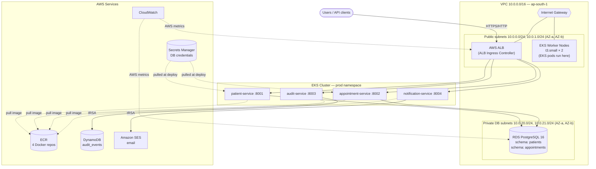
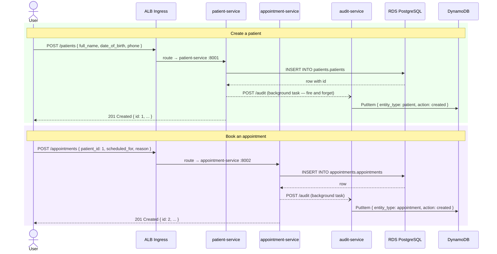
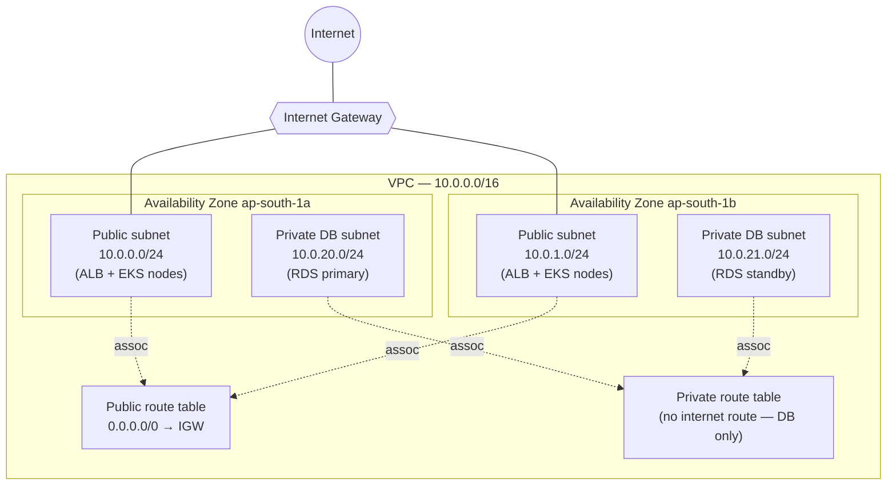
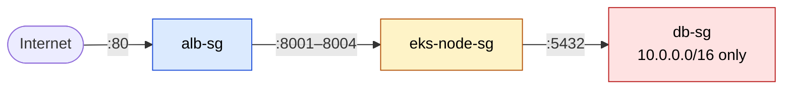
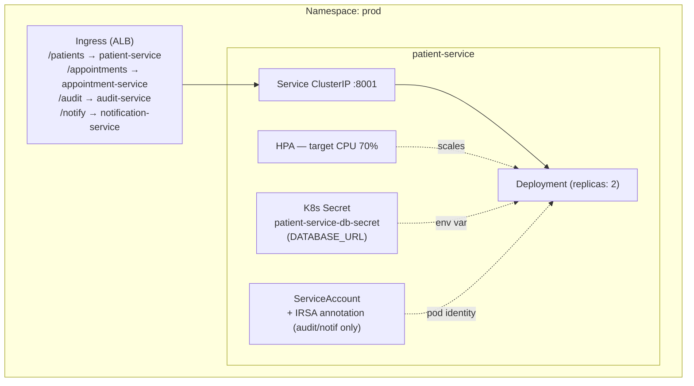
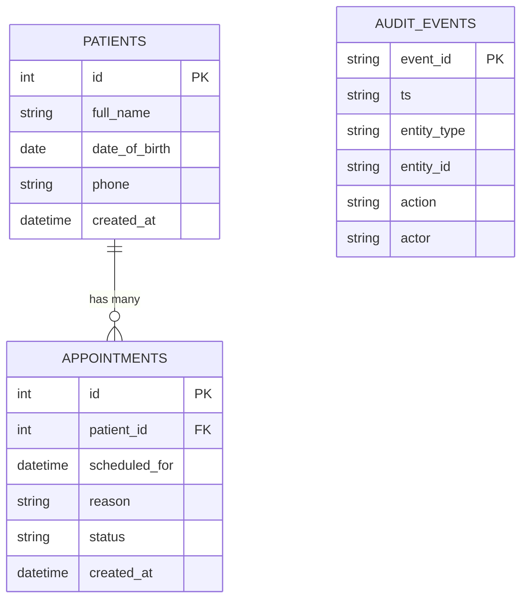
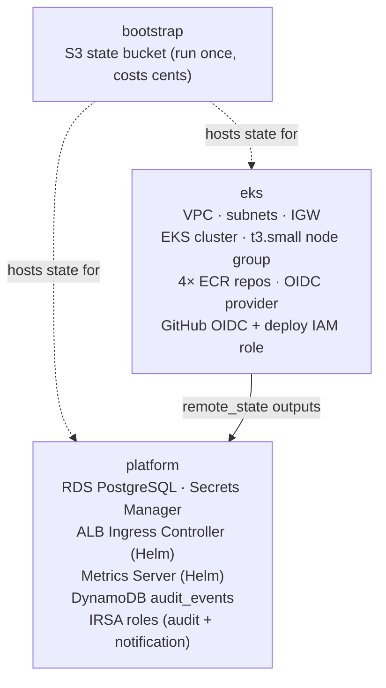

# CloudCare-K8s — AWS DevOps Showcase v2

> **The evolution of CloudCare.**
> Same hospital management system. Migrated from a monolithic EC2/ASG deployment
> to a **microservices architecture orchestrated on Kubernetes** — the way modern
> engineering teams actually run production workloads.

**Region** `ap-south-1` (Mumbai) · **IaC** Terraform 1.9+ · **Orchestration** Kubernetes 1.30 on EKS ·
**Backend** Python 3.12 + FastAPI (4 microservices) · **CI/CD** GitHub Actions + OIDC ·
**Observability** Prometheus + Grafana + Loki

---

## Scope — what this repo is and isn't

This project demonstrates **Kubernetes, microservices operations, and cloud-native SRE** on AWS.
The hospital management app (patients, appointments) is intentionally minimal CRUD — it exists to
give the infrastructure something real to host and operate.

> **No frontend in this repo.**
> The React frontend and its CDN infrastructure (S3 + CloudFront + GitHub Actions deploy workflow)
> live entirely in the companion **[cloud-care](../cloud-care)** repository (v1).
> This repo is 100% backend: microservices, Kubernetes, Helm, EKS, and CI/CD for those services.
>
> In a real production setup the same React SPA from v1 would point its `/api/*` calls at
> the ALB Ingress in this cluster — the frontend itself needs no changes. That's why we
> don't duplicate it here.
>
> To evaluate this project, read the Terraform stacks, Helm charts, and GitHub Actions workflows.

---

## How v2 Differs from CloudCare v1

| Concern | CloudCare v1 (EC2/ASG) | CloudCare-K8s v2 (EKS) |
|---|---|---|
| Deployment unit | Single FastAPI monolith | 4 independent microservices |
| Compute | EC2 Auto Scaling Group | EKS node group (t3.small) |
| Scaling | ASG instance-refresh (~5 min) | HPA pod scale-out (~30 sec) |
| Rollout strategy | New AMI, wait for health check | Kubernetes rolling deploy |
| Rollback | Re-push previous image | `helm rollback <service> <revision>` |
| Image tagging | `:latest` | Git SHA (`:abc1234`) — immutable |
| Secrets | Fetched at EC2 boot | K8s Secrets created from Secrets Manager |
| Observability | CloudWatch only | Prometheus + Grafana + Loki + CloudWatch |
| Config management | Env vars baked into launch template | ConfigMaps + Secrets per namespace |
| Multi-environment | Single environment | `dev` and `prod` namespaces |
| CI/CD scope | One pipeline for the whole backend | One pipeline **per service** |

---

## Tech Stack

<table>
  <tr>
    <td width="33%" valign="top">
      <h4>Cloud &amp; Orchestration</h4>
      <p>
        
        
        
        
        
      </p>
      <sub>EKS managed control plane; Terraform declares every resource; Helm packages per-service charts with dev/prod value overlays.</sub>
    </td>
    <td width="33%" valign="top">
      <h4>Compute &amp; Networking</h4>
      <p>
        
        
        
        
      </p>
      <sub>EKS t3.small node group in public subnets (direct IGW access); one ECR repo per service; AWS ALB Ingress Controller routes external traffic via path-based rules.</sub>
    </td>
    <td width="33%" valign="top">
      <h4>Edge (v1 — cloud-care repo)</h4>
      <p>
        
        
      </p>
      <sub>Defined in the companion cloud-care (v1) repo — not in this repo. CloudFront serves the React SPA from private S3 and forwards /api/* to this cluster's ALB Ingress.</sub>
    </td>
  </tr>
  <tr>
    <td width="33%" valign="top">
      <h4>Data</h4>
      <p>
        
        
        
      </p>
      <sub>Schema-per-service on shared RDS (patients schema, appointments schema); audit events in DynamoDB; Secrets Manager stores DB credentials synced to K8s Secrets at deploy time.</sub>
    </td>
    <td width="33%" valign="top">
      <h4>Observability</h4>
      <p>
        
        
        
        
      </p>
      <sub>Prometheus scrapes all pods; Grafana dashboards service health & latency; Loki aggregates logs via Promtail; CloudWatch covers AWS-native resources (RDS, ALB, EKS control plane).</sub>
    </td>
    <td width="33%" valign="top">
      <h4>Identity &amp; CI/CD</h4>
      <p>
        
        
      </p>
      <sub>IRSA gives each pod its own AWS identity — no node-level credentials; keyless CI via OIDC; one pipeline per service for independent deployability.</sub>
    </td>
  </tr>
  <tr>
    <td width="33%" valign="top">
      <h4>Application</h4>
      <p>
        
      </p>
      <sub>4 Python 3.12 FastAPI microservices — the simplest CRUD needed to give the Kubernetes infrastructure something real to run. No frontend code in this repo.</sub>
    </td>
    <td width="33%" valign="top">
      <h4>Local Dev</h4>
      <p>
        
      </p>
      <sub>Full stack runs locally via Docker Compose with DynamoDB Local and PostgreSQL — no cloud costs during development.</sub>
    </td>
    <td width="33%" valign="top">
      <h4>Messaging</h4>
      <p>
        
      </p>
      <sub>notification-service calls SES for transactional email via IRSA — no stored AWS credentials in the pod.</sub>
    </td>
  </tr>
</table>

---

## Engineering Practices Demonstrated

| # | Practice | Where to find it |
|---|---|---|
| 1 | **Microservices decomposition** — logical boundaries, independent deployability | `services/`, `helm/`, `.github/workflows/` |
| 2 | **Kubernetes-native scaling** — HPA replaces ASG instance-refresh | `helm/*/templates/hpa.yaml` |
| 3 | **Immutable image tags** — git SHA, not `:latest` | every `*-service.yml` workflow |
| 4 | **GitOps deployment** — Helm chart is source of truth, CI applies it | `helm/`, workflows |
| 5 | **IRSA least-privilege** — pod-level AWS identity, not node-level credentials | `terraform/platform/irsa.tf` |
| 6 | **K8s Secrets from Secrets Manager** — credentials never in Git or Helm values | `k8s/` + deploy scripts |
| 7 | **Multi-environment** — `dev` vs `prod` namespace via Helm value overlays | `helm/*/values-prod.yaml` |
| 8 | **Three-pillar observability** — metrics (Prometheus), logs (Loki), dashboards (Grafana) | `docs/09-observability.md` |
| 9 | **Keyless CI/CD** — GitHub OIDC, no stored AWS keys, `sub` claim pinned to repo | `terraform/eks/oidc.tf` |
| 10 | **Database-per-service pattern** — schema isolation, service-specific DB users | `docs/02-microservices-split.md` |

---

## Table of Contents

- [Architecture at a glance](#architecture-at-a-glance)
- [Architecture diagram](#architecture-diagram)
- [Microservices breakdown](#microservices-breakdown)
- [Request flow](#request-flow)
- [Network topology](#network-topology)
- [Security architecture](#security-architecture)
- [Kubernetes resource model](#kubernetes-resource-model)
- [Data model](#data-model)
- [Infrastructure modules](#infrastructure-modules)
- [CI/CD pipeline](#cicd-pipeline)
- [Observability](#observability)
- [Repository structure](#repository-structure)
- [Prerequisites](#prerequisites)
- [Quick start — deploy from scratch](#quick-start--deploy-from-scratch)
- [Local development](#local-development)
- [Cost](#cost)
- [Teardown](#teardown)
- [Documentation & learning path](#documentation--learning-path)

---

## Architecture at a glance

Users hit the **AWS ALB** (provisioned by the ALB Ingress Controller). Path-based rules route
requests to the appropriate microservice **pods** inside the **EKS cluster**.

Four microservices run in the `prod` namespace: `patient-service`, `appointment-service`,
`audit-service`, and `notification-service` — each independently deployable with its own
ECR repo, Helm chart, and GitHub Actions pipeline. Services talk to a private
**RDS PostgreSQL** instance using schema-per-service isolation. DB credentials are stored in
**Secrets Manager** and pulled into **Kubernetes Secrets** at deploy time.

The audit-service writes to **DynamoDB** via IRSA (no stored AWS keys). The notification-service
sends email via **SES**, also via IRSA.

---

## Architecture diagram



---

## Microservices Breakdown

Each service is independently deployable with its own Docker image, ECR repo, Helm chart,
GitHub Actions workflow, and database schema.

| Service | Port | Routes | Stores data in |
|---|---|---|---|
| `patient-service` | 8001 | `GET/POST /patients`, `GET/PUT/DELETE /patients/{id}` | RDS — `patients` schema |
| `appointment-service` | 8002 | `GET/POST /appointments`, `GET/PUT/DELETE /appointments/{id}` | RDS — `appointments` schema |
| `audit-service` | 8003 | `POST /audit`, `GET /audit` | DynamoDB — `audit_events` table |
| `notification-service` | 8004 | `POST /notify` | — (calls SES, no persistence) |

---

## Request flow

A typical "create a patient, book an appointment" sequence:



---

## Network topology

Six subnets across two AZs, three tiers. **EKS nodes are in public subnets** — they get public
IPs and reach the internet directly through the IGW (no NAT needed).



| CIDR | Tier | Public? | Purpose |
|------|------|---------|---------|
| `10.0.0.0/24`, `10.0.1.0/24` | Public | ✅ (→ IGW) | ALB Ingress + EKS worker nodes |
| `10.0.10.0/24`, `10.0.11.0/24` | App (private) | ❌ (unused) | Reserved — not currently used |
| `10.0.20.0/24`, `10.0.21.0/24` | DB (private) | ❌ (local only) | RDS PostgreSQL |

> **Why nodes are in public subnets:** The original design placed nodes in private subnets
> with a NAT instance for ECR access. During deployment, nodes failed to join the cluster
> (NodeCreationFailure after 33+ minutes) because the DIY NAT instance couldn't reliably
> forward traffic to the EKS API endpoint and ECR. Moving nodes to public subnets (direct
> IGW access) resolved the issue immediately. Security is maintained via Security Groups —
> no SSH ports are open, and pod traffic is controlled by EKS-managed security groups.

---

## Security architecture

### Defense in depth — the security-group chain



### IAM principles applied

- **No long-lived AWS keys in GitHub** — CI authenticates via GitHub OIDC → `sts:AssumeRoleWithWebIdentity` → 1-hour creds per job
- **IRSA per pod** — audit-service and notification-service each have their own IAM role. A compromised pod cannot use another service's permissions
- **IMDSv2 enforced** on all EKS nodes (`http_tokens = "required"`) to block SSRF-based credential theft
- **RDS not publicly accessible** — `publicly_accessible = false`, SG allows only VPC traffic on port 5432
- **Secrets never in Git** — DB credentials live in Secrets Manager, pulled into K8s Secrets at deploy time

---

## Kubernetes resource model



---

## Data model



`PATIENTS` and `APPOINTMENTS` live in **RDS PostgreSQL** under schema-per-service isolation.
`AUDIT_EVENTS` lives in **DynamoDB** — high-volume, write-heavy, no joins needed.

---

## Infrastructure modules

Three Terraform stacks, each with its own state key in S3:

```
s3://cloudcare-k8s-tfstate-<account>/
  bootstrap/terraform.tfstate   ← local state only (run once)
  eks/terraform.tfstate          ← VPC, EKS, ECR, OIDC
  platform/terraform.tfstate     ← RDS, Secrets Manager, ALB controller, IRSA, DynamoDB
```



| Stack | Apply time | Destroyable? | Cost if left running |
|-------|-----------|--------------|----------------------|
| `bootstrap` | ~1 min | ❌ (holds all state) | ~cents/mo |
| `eks` | ~15 min | ✅ | ~$5–8/day |
| `platform` | ~8 min | ✅ | ~$1–2/day |

---

## CI/CD pipeline

### Authentication — no stored AWS keys

Every workflow authenticates to AWS using **OIDC**. GitHub generates a short-lived JWT per
workflow run. AWS STS exchanges it for 15-minute temporary credentials.

```
GitHub Actions JWT  →  AWS STS AssumeRoleWithWebIdentity  →  15-min temp credentials
(auto-generated        (verified against OIDC provider             (scoped to one IAM role,
 per job run)           in terraform/eks/oidc.tf)                    expires automatically)
```

### Service deploy pipeline — per service workflow

```
build job
  ├── docker build -t <ecr-url>/<service>:<git-sha> .
  └── docker push :<git-sha>      ← immutable tag

deploy-dev (branch = dev)
  └── helm upgrade --install <service> ./helm/<service>
        -f helm/<service>/values-dev.yaml
        --set image.tag=<git-sha>
        --namespace dev

deploy-prod (branch = main)
  └── helm upgrade --install <service> ./helm/<service>
        -f helm/<service>/values-prod.yaml
        --set image.tag=<git-sha>
        --namespace prod
```

---

## Observability

Three pillars planned in the `monitoring` namespace (see [docs/09-observability.md](docs/09-observability.md)):

| Signal | Source | Tool |
|--------|--------|------|
| Pod metrics (CPU, memory, RPS) | Prometheus scrape | Grafana dashboard |
| Pod logs | Promtail DaemonSet | Loki → Grafana |
| RDS / ALB metrics | CloudWatch | Grafana AWS datasource |
| HPA decisions | metrics-server | `kubectl top pods` |

---

## Repository Structure

```
cloud-care-k8s/
│
├── README.md
│
├── services/                          ← one directory per microservice
│   ├── patient-service/
│   │   ├── app/{main,models,schemas,database}.py
│   │   ├── Dockerfile
│   │   └── requirements.txt
│   ├── appointment-service/           ← same structure
│   ├── audit-service/                 ← uses DynamoDB instead of RDS
│   ├── notification-service/          ← calls SES, no DB
│   ├── docker-compose.yml             ← local dev: all 4 services + postgres + dynamodb-local
│   └── init.sql                       ← schema seeds for local postgres
│
├── helm/                              ← one Helm chart per service
│   └── <service>/
│       ├── Chart.yaml
│       ├── values.yaml                ← base defaults (local dev)
│       ├── values-prod.yaml           ← prod overrides (2 replicas, HPA, IRSA, prod image)
│       └── templates/
│           ├── deployment.yaml        ← reads databaseSecretName or databaseUrl
│           ├── service.yaml
│           ├── hpa.yaml
│           ├── serviceaccount.yaml    ← created only if serviceAccount.roleArn is set
│           └── _helpers.tpl
│
├── k8s/
│   └── ingress.yaml                   ← single ALB Ingress for all 4 services (path-based)
│
├── terraform/
│   ├── bootstrap/main.tf              ← S3 state bucket (run once)
│   ├── eks/
│   │   ├── backend.tf                 ← S3 backend + provider versions
│   │   ├── vpc.tf                     ← VPC, subnets, IGW, route tables
│   │   ├── eks.tf                     ← EKS cluster, node group (public subnets, t3.small)
│   │   ├── ecr.tf                     ← 4 ECR repos
│   │   ├── oidc.tf                    ← EKS OIDC + GitHub OIDC + deploy IAM role
│   │   └── outputs.tf                 ← vpc_id, subnet IDs, cluster_name, oidc ARN/URL
│   └── platform/
│       ├── providers.tf               ← S3 backend, provider versions (aws ~>6.0, helm ~>3.0)
│       ├── remote_state.tf            ← reads eks stack outputs
│       ├── rds.tf                     ← RDS PostgreSQL, subnet group, SG, random password
│       ├── secrets.tf                 ← Secrets Manager secrets (recovery_window_in_days=0)
│       ├── alb.tf                     ← ALB Ingress Controller + metrics-server (Helm)
│       └── irsa.tf                    ← DynamoDB table + IRSA roles for audit + notification
│
├── .github/workflows/
│   ├── deploy-patient-service.yml
│   ├── deploy-appointment-service.yml
│   ├── deploy-audit-service.yml
│   ├── deploy-notification-service.yml
│   └── terraform.yml
│
└── docs/                              ← numbered guides, one per phase
    ├── 00-roadmap.md
    ├── 01-local-setup.md
    ├── 02-microservices-split.md
    ├── 03a-k8s-concepts.md / 03b-k8s-practice.md
    ├── 04a-helm-concepts.md / 04b-helm-practice.md
    ├── 05a-eks-concepts.md  / 05b-eks-practice.md
    ├── 06a-cicd-concepts.md / 06b-cicd-practice.md
    ├── 07a-secrets-concepts.md / 07b-secrets-practice.md
    ├── 08a-hpa-concepts.md  / 08b-hpa-practice.md
    └── 09-observability.md
```

---

## Prerequisites

- **AWS account** with IAM admin user and MFA enabled
- **AWS CLI v2** authenticated (`aws sts get-caller-identity` succeeds)
- **Terraform** `>= 1.9`
- **kubectl** + **Helm 3** (`helm version`)
- **Docker Desktop** (includes Docker Compose)
- **Python 3.12** (for local dev — Docker is fine too)

---

## Quick Start — Deploy from Scratch

### Phase 0 — Bootstrap Terraform state (run once ever)

```bash
# Creates the S3 bucket that stores all Terraform state files.
# Run once — never destroy this bucket.
cd terraform/bootstrap
terraform init
terraform apply \
  -var="state_bucket_name=cloudcare-k8s-tfstate-$(aws sts get-caller-identity --query Account --output text)"
```

### Phase 1 — Provision EKS cluster (~15 min)

```bash
cd terraform/eks

# Download providers and connect to S3 backend
terraform init

# Preview what will be created (VPC, EKS, ECR, OIDC)
terraform plan

# Create the infrastructure — EKS control plane starts billing (~$0.10/hr) from here
terraform apply

# Configure kubectl to talk to the new cluster
aws eks update-kubeconfig --name cloudcare-k8s --region ap-south-1

# Verify — should show 2 t3.small nodes in Ready state
kubectl get nodes
```

### Phase 2 — Provision platform resources (~8 min)

```bash
cd terraform/platform

# Download providers (helm ~>3.0, aws ~>6.0) and connect to S3 backend
terraform init

# Creates: RDS PostgreSQL, Secrets Manager secrets,
#          ALB Ingress Controller (Helm), Metrics Server (Helm),
#          DynamoDB audit_events table, IRSA roles for audit + notification services
terraform apply
```

### Phase 3 — Initialize the database (one-time, after platform apply)

RDS creates the database with only the master user (`cloudcare_admin`).
The service-specific users (`patient_svc`, `appt_svc`) must be created manually:

```bash
# Get all credentials from Terraform state (passwords are alphanumeric — safe to pass via env)
MASTER_PASS=$(terraform state pull | python3 -c "
import sys, json
state = json.load(sys.stdin)
for r in state['resources']:
    if r['type'] == 'random_password' and r['name'] == 'db_master':
        print(r['instances'][0]['attributes']['result'])
")

PATIENT_PASS=$(aws secretsmanager get-secret-value \
  --secret-id cloudcare-k8s/patient-service/db --query SecretString --output text \
  | python3 -c "import sys,json; from urllib.parse import urlparse; print(urlparse(json.load(sys.stdin)['DATABASE_URL']).password)")

APPT_PASS=$(aws secretsmanager get-secret-value \
  --secret-id cloudcare-k8s/appointment-service/db --query SecretString --output text \
  | python3 -c "import sys,json; from urllib.parse import urlparse; print(urlparse(json.load(sys.stdin)['DATABASE_URL']).password)")

RDS_HOST=$(terraform state pull | python3 -c "
import sys, json
from urllib.parse import urlparse
state = json.load(sys.stdin)
for r in state['resources']:
    if r['type'] == 'aws_db_instance':
        ep = r['instances'][0]['attributes']['endpoint']
        print(urlparse('postgresql://' + ep).hostname)
")

# Free up a node slot if needed (EKS nodes have limited pod capacity on t3.small)
kubectl scale deployment patient-service appointment-service -n prod --replicas=0 2>/dev/null; true

# Run a one-time psql pod inside the cluster to reach the private RDS
kubectl run psql-init -n prod --restart=Never --image=postgres:16 -- sleep 300
kubectl wait pod/psql-init -n prod --for=condition=Ready --timeout=60s

# Create service users and grant schema permissions
kubectl exec -n prod psql-init -- psql \
  "postgresql://cloudcare_admin:${MASTER_PASS}@${RDS_HOST}/cloudcare?sslmode=require" \
  -c "CREATE USER patient_svc WITH PASSWORD '${PATIENT_PASS}';" \
  -c "CREATE SCHEMA IF NOT EXISTS patients;" \
  -c "GRANT CONNECT ON DATABASE cloudcare TO patient_svc;" \
  -c "GRANT USAGE, CREATE ON SCHEMA patients TO patient_svc;" \
  -c "ALTER DEFAULT PRIVILEGES IN SCHEMA patients GRANT ALL ON TABLES TO patient_svc;" \
  -c "CREATE USER appt_svc WITH PASSWORD '${APPT_PASS}';" \
  -c "CREATE SCHEMA IF NOT EXISTS appointments;" \
  -c "GRANT CONNECT ON DATABASE cloudcare TO appt_svc;" \
  -c "GRANT USAGE, CREATE ON SCHEMA appointments TO appt_svc;" \
  -c "ALTER DEFAULT PRIVILEGES IN SCHEMA appointments GRANT ALL ON TABLES TO appt_svc;"

kubectl delete pod psql-init -n prod
```

### Phase 4 — Create K8s Secrets from Secrets Manager

The services read `DATABASE_URL` from a Kubernetes Secret (not from Helm values — this
avoids shell escaping problems with connection strings containing `://` and `@`):

```bash
# Pull the full DATABASE_URL for each service from Secrets Manager
PATIENT_DB_URL=$(aws secretsmanager get-secret-value \
  --secret-id cloudcare-k8s/patient-service/db --query SecretString --output text \
  | python3 -c "import sys,json; print(json.load(sys.stdin)['DATABASE_URL'])")

APPT_DB_URL=$(aws secretsmanager get-secret-value \
  --secret-id cloudcare-k8s/appointment-service/db --query SecretString --output text \
  | python3 -c "import sys,json; print(json.load(sys.stdin)['DATABASE_URL'])")

# Create K8s Secrets in the prod namespace
# These survive helm upgrade — they are NOT managed by Helm
kubectl create secret generic patient-service-db-secret \
  --from-literal=DATABASE_URL="$PATIENT_DB_URL" \
  -n prod --dry-run=client -o yaml | kubectl apply -f -

kubectl create secret generic appointment-service-db-secret \
  --from-literal=DATABASE_URL="$APPT_DB_URL" \
  -n prod --dry-run=client -o yaml | kubectl apply -f -
```

### Phase 5 — Build and deploy all services

```bash
ACCOUNT=$(aws sts get-caller-identity --query Account --output text)
REGION=ap-south-1
SHA=$(git rev-parse --short HEAD)

# Log in to ECR (token valid for 12 hours)
aws ecr get-login-password --region "$REGION" \
  | docker login --username AWS --password-stdin "$ACCOUNT.dkr.ecr.$REGION.amazonaws.com"

# Build, push, and deploy each service
for svc in patient-service appointment-service audit-service notification-service; do
  ECR="$ACCOUNT.dkr.ecr.$REGION.amazonaws.com/cloudcare-k8s-$svc"

  # Build the Docker image tagged with git SHA
  ( cd services/$svc && docker build -t "$ECR:$SHA" . && docker push "$ECR:$SHA" )

  # Deploy to prod — values-prod.yaml sets replicas=2, HPA enabled, IRSA ServiceAccount
  helm upgrade --install $svc ./helm/$svc \
    -f helm/$svc/values-prod.yaml \
    --set image.tag="$SHA" \
    --namespace prod --create-namespace
done

# Watch all 8 pods reach Running state
kubectl get pods -n prod -w
```

### Phase 6 — Apply Ingress and verify

```bash
# Create the ALB Ingress (path-based routing to all 4 services)
kubectl apply -f k8s/ingress.yaml

# Wait ~2 minutes for ALB to be provisioned, then get the DNS name
kubectl get ingress cloudcare-ingress -n prod

ALB=$(kubectl get ingress cloudcare-ingress -n prod \
  -o jsonpath='{.status.loadBalancer.ingress[0].hostname}')

# Test the APIs
curl "http://$ALB/health"                                       # → {"status":"ok"}
curl -X POST "http://$ALB/patients" \
  -H "Content-Type: application/json" \
  -d '{"full_name":"Jane Doe","date_of_birth":"1990-01-01","phone":"+94771234567"}'
curl "http://$ALB/patients"                                     # → [{"id":1,...}]
curl "http://$ALB/audit"                                        # → audit events from DynamoDB
```

---

## Local Development

```bash
# Run all 4 services + postgres + dynamodb-local
cd services/
docker compose up --build

# patient-service      → http://localhost:8001/docs
# appointment-service  → http://localhost:8002/docs
# audit-service        → http://localhost:8003/docs
# notification-service → http://localhost:8004/docs
```

---

## Cost

| Resource | Est. daily cost | Notes |
|---|---|---|
| EKS control plane | ~$2.40/day | No free tier — destroy when not working |
| 2× t3.small nodes | ~$1.00/day | $0.023/hr each |
| RDS `db.t3.micro` | ~$0.40/day | 750 hrs/mo free tier covers first year |
| ALB (Ingress) | ~$0.50/day | Fixed hourly + LCU charge |
| ECR (4 repos) | ~$0 | 500 MB/mo free tier |
| DynamoDB | ~$0 | Pay-per-request; near-zero at lab volume |
| Secrets Manager | ~$0.01/day | $0.40/secret/month |
| **Estimated total** | **~$4.30/day** | Destroy EKS + platform when not working |

> **Workflow**: develop and iterate locally with Docker Compose (zero cost).
> Spin up EKS only for integration tests. Destroy immediately after.

---

## Teardown

Destroy in reverse-dependency order:

```bash
# Uninstall Helm releases (removes K8s resources but NOT the RDS or ECR images)
for svc in patient-service appointment-service audit-service notification-service; do
  helm uninstall $svc -n prod 2>/dev/null || true
done
helm uninstall aws-load-balancer-controller -n kube-system 2>/dev/null || true
helm uninstall metrics-server -n kube-system 2>/dev/null || true

# Destroy platform stack first (RDS, DynamoDB, Secrets Manager, IAM roles)
cd terraform/platform && terraform destroy -auto-approve

# Then destroy EKS stack (cluster, nodes, VPC, ECR)
cd ../eks && terraform destroy -auto-approve

# Leave bootstrap/ alone — it holds all Terraform state and costs cents/month
```

> **Note:** Secrets Manager has a 7-day deletion window by default. The secrets.tf uses
> `recovery_window_in_days = 0` to force-delete immediately, so re-apply works the next day.

---

## Documentation & Learning Path

The [`docs/`](docs/) folder contains numbered guides walking through every phase:

| Phase | Topic | Doc |
|------:|-------|-----|
| 0 | Setup · Docker Compose · minikube basics | [00-roadmap.md](docs/00-roadmap.md) |
| 1 | Local dev setup | [01-local-setup.md](docs/01-local-setup.md) |
| 2 | Microservices split — 4 independent services | [02-microservices-split.md](docs/02-microservices-split.md) |
| 3 | Kubernetes manifests | [03a-k8s-concepts.md](docs/03a-k8s-concepts.md) · [03b-k8s-practice.md](docs/03b-k8s-practice.md) |
| 4 | Helm charts — packaging, values, dev/prod overlays | [04a-helm-concepts.md](docs/04a-helm-concepts.md) · [04b-helm-practice.md](docs/04b-helm-practice.md) |
| 5 | EKS cluster with Terraform | [05a-eks-concepts.md](docs/05a-eks-concepts.md) · [05b-eks-practice.md](docs/05b-eks-practice.md) |
| 6 | CI/CD — per-service GitHub Actions pipelines | [06a-cicd-concepts.md](docs/06a-cicd-concepts.md) · [06b-cicd-practice.md](docs/06b-cicd-practice.md) |
| 7 | IRSA + K8s Secrets from Secrets Manager | [07a-secrets-concepts.md](docs/07a-secrets-concepts.md) · [07b-secrets-practice.md](docs/07b-secrets-practice.md) |
| 8 | HPA — horizontal pod autoscaling | [08a-hpa-concepts.md](docs/08a-hpa-concepts.md) · [08b-hpa-practice.md](docs/08b-hpa-practice.md) |
| 9 | Prometheus + Grafana + Loki | [09-observability.md](docs/09-observability.md) |

---

## Known Issues & Resolutions

| Issue | Root Cause | Fix |
|-------|-----------|-----|
| NodeCreationFailure (33+ min timeout) | DIY NAT instance couldn't route EKS API / ECR traffic reliably from private subnets | Moved node group to public subnets (`subnet_ids = aws_subnet.public[*].id`) |
| `t3.micro` nodes crash — OOMKilled | Too little RAM for EKS CNI + system pods + app pods | Changed to `t3.small` |
| ALB controller CrashLoopBackOff — `EC2MetadataError 401` | Controller couldn't discover VPC ID via IMDSv2 | Added `vpcId` to Helm set values in `alb.tf` |
| `password authentication failed for user "patient_svc"` | Terraform creates Secrets Manager entries but never runs `CREATE USER` in PostgreSQL | Manual one-time psql pod init (Phase 3 above) |
| `Secrets Manager: already scheduled for deletion` | Re-applied platform after partial destroy within 7-day window | Added `recovery_window_in_days = 0` to `secrets.tf` |
| `DATABASE_URL` KeyError / empty env var | Helm `--set` mangles URLs containing `://` and `@` | Created K8s Secret and referenced via `secretKeyRef` in deployment template |
| Helm provider v3 breaking change | `kubernetes {}` block → `kubernetes = {}` assignment; `set {}` blocks → `set = [...]` list | Updated `providers.tf` and `alb.tf` |
| State lock left open | Previous `terraform apply` crashed mid-run | `terraform force-unlock <lock-id>` |

---

<sub>Architecture references: AWS Well-Architected Framework · CNCF Landscape ·
Built as a portfolio project demonstrating AWS DevOps, SRE, and Kubernetes engineering practices.
The application logic is intentionally minimal — the infrastructure, pipelines, and
operational practices are the deliverable.</sub>
